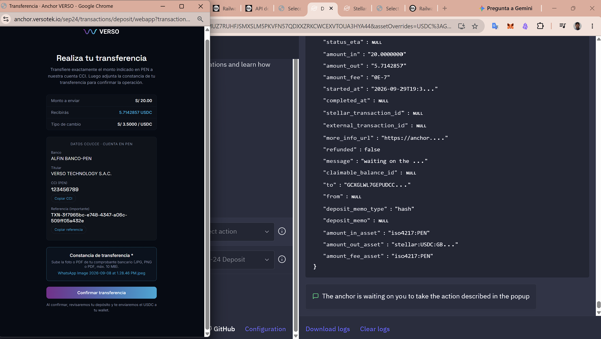
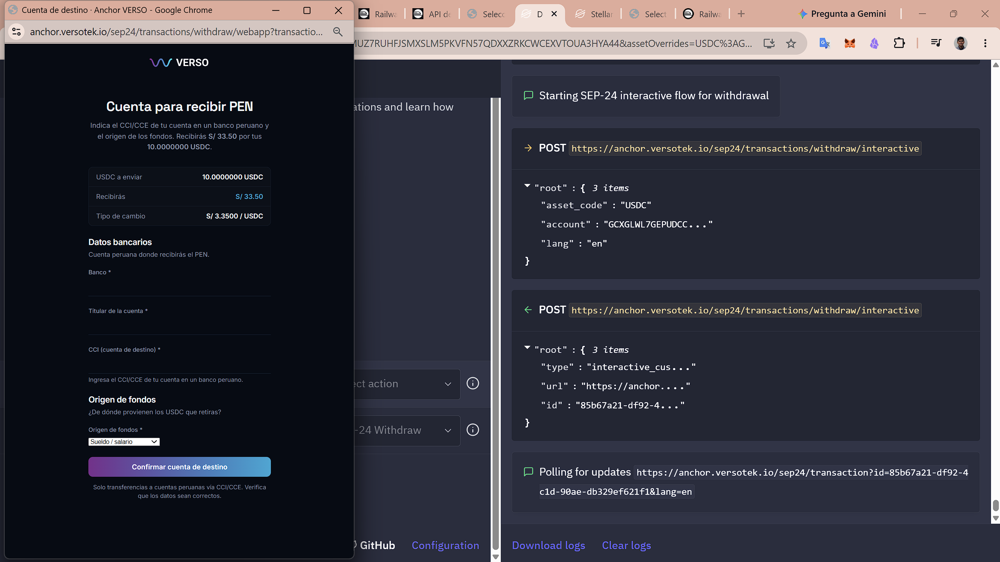
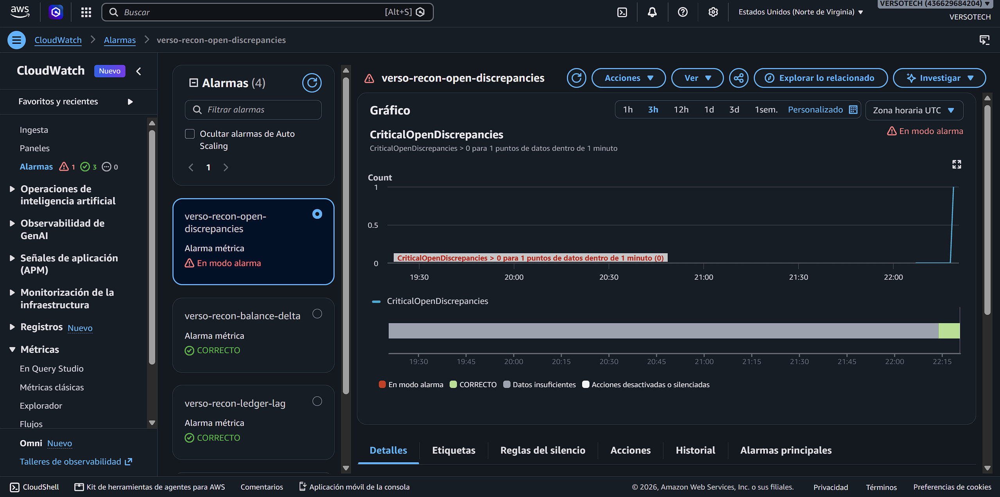
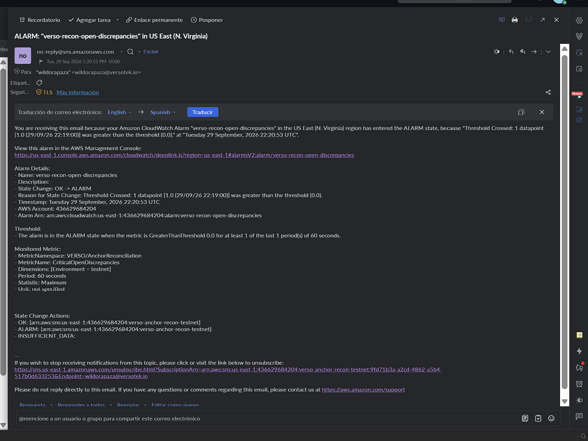
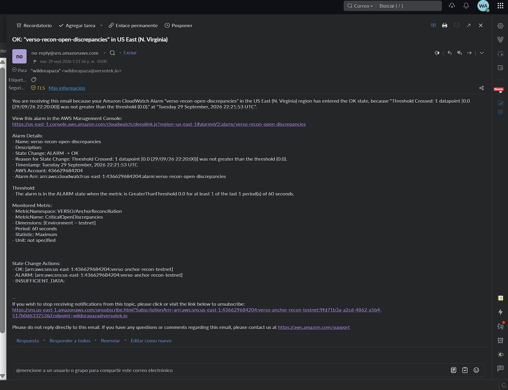
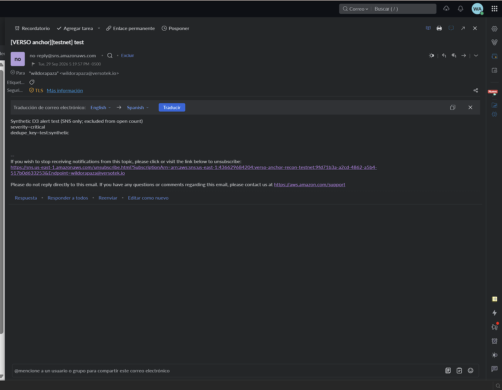
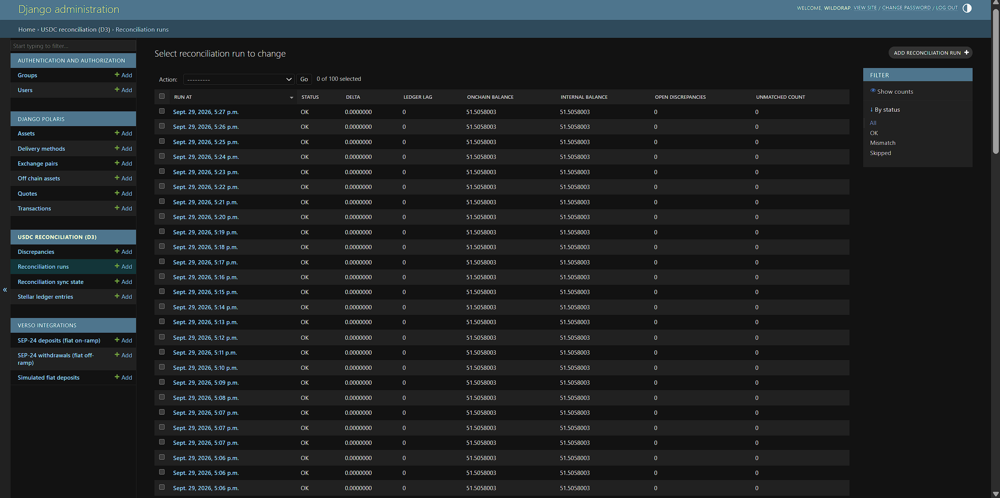

# Tranche 2 — Deliverable evidence (testnet)

Anchor: `anchor.versotek.io` · Network: Stellar testnet · Hot wallet (`SIGNING_SEED`):
[`GBTV5QYBPGHGT2SVUHCFRRKFFWUWHOEPKH7QAXGTJHFGFYZRIE24UOPB`](https://stellar.expert/explorer/testnet/account/GBTV5QYBPGHGT2SVUHCFRRKFFWUWHOEPKH7QAXGTJHFGFYZRIE24UOPB)

Sources: Polaris `Transaction` table in production PostgreSQL (queried from the Railway shell on
2026-09-29) cross-checked against Horizon testnet payments of the hot wallet. Every transaction
listed below has status `completed` in Polaris and a successful on-chain USDC payment whose hash
matches `stellar_transaction_id`.

---

## Deliverable 1 — SEP-24 on-ramp and off-ramp

**Criterion:** 10+ testnet on-ramp and off-ramp transactions completed.
**Result:** **17 completed** (12 on-ramp + 5 off-ramp), **11 of them in PEN** (8 on-ramp + 3 off-ramp),
from **2 different client accounts**:

- Client A: `GCXGLWL7GEPUDCCZABQVLHTZLDWWXPTURGXODJ6JF6BVJSO4KWU45IFG`
- Client B: `GCVG4VP35KSB2X74XLSIN6NM3I5BGCR3N55LG2LFA4BIW5X2TQBKJUJZ`

### On-ramp (fiat → USDC) — 12 completed

Flow: wallet SEP-10 → SEP-24 interactive webview (VERSO login + KYC) → CCI/CCE instructions →
operations confirm fiat receipt in admin (**Mark PEN received**, Phase 1 manual settlement) →
`process_pending_deposits` (Railway **DEPOSITO**) sends USDC on-chain.

| # | SEP-24 id | Fiat | Fiat in | USDC out | Rate (fiat/USDC) | Client | Completed (UTC) | Stellar tx |
| - | --------- | ---- | ------- | -------- | ---------------- | ------ | --------------- | ---------- |
| 1 | `3e352ab3-dd7f-4aec-b105-1bfb965e83e5` | PEN | 12.00 | 3.5555556 | 3.3750 | A | 2026-09-27 03:16:52 | [`86008fd0…`](https://stellar.expert/explorer/testnet/tx/86008fd0b5b8ce229a15f23e2480e1da20ecfb4254bcd76358f6b09a5f232b5c) |
| 2 | `86bdaca0-d0b0-4766-af81-c444060f758b` | PEN | 9.00 | 2.6666667 | 3.3750 | A | 2026-09-27 03:22:47 | [`036f1346…`](https://stellar.expert/explorer/testnet/tx/036f1346a1dd6b6af7e4c05fd7758163ba0db2cb6218c2e03c3cd770befc1597) |
| 3 | `d214aa68-d7f6-42db-8ffd-b450268c1e40` | PEN | 5.00 | 1.4814815 | 3.3750 | A | 2026-09-27 16:05:12 | [`1ebedee7…`](https://stellar.expert/explorer/testnet/tx/1ebedee7c2d11833f3ee02cc9476711f390f4900188b62d440189a52f033abd0) |
| 4 | `adeefc2a-4a9d-42ab-bb46-084d6c5368ef` | PEN | 10.00 | 2.9629630 | 3.3750 | A | 2026-09-27 17:21:57 | [`9fc94f47…`](https://stellar.expert/explorer/testnet/tx/9fc94f4746a187fa94da7f86eb62b50149f54286f1df1e931ccc44ab8bf687a8) |
| 5 | `0d0d6fa7-5b0a-4c67-87df-42e9109bcbcf` | PEN | 10.00 | 2.9629630 | 3.3750 | A | 2026-09-27 17:30:12 | [`47fb1661…`](https://stellar.expert/explorer/testnet/tx/47fb166133684e8e40b7fabee26b55480db3309a6a501041f1860b6f25468711) |
| 6 | `175256f0-d8b3-44f9-a3cd-134d59a6bf59` | PEN | 3.00 | 0.8888889 | 3.3750 | A | 2026-09-27 17:42:42 | [`88d5bb8f…`](https://stellar.expert/explorer/testnet/tx/88d5bb8f6a9f00ac974980029d45228e85abb0a6936d3b81a0336f053af0ab4d) |
| 7 | `fd743485-3a1f-4666-ba6e-44fbfe375cfb` | PEN | 1.00 | 0.2962963 | 3.3750 | A | 2026-09-28 02:52:07 | [`eb44b9b3…`](https://stellar.expert/explorer/testnet/tx/eb44b9b3e024d4304b74a51ee45f39ca866761f4a78374852e2dd1beabd02f44) |
| 8 | `258aee94-e18b-4bc9-bd34-77dcc82e2b21` | USD | 10.00 | 9.9009901 | 1.0100 | A | 2026-09-29 17:21:27 | [`50215452…`](https://stellar.expert/explorer/testnet/tx/50215452263b75df502ba217c5b20c4f9827a3aef78ccf34718a314107bd8a84) |
| 9 | `9701e189-227a-4729-9d33-8329e5be9352` | USD | 5.00 | 4.9504950 | 1.0100 | B | 2026-09-29 18:53:37 | [`d98f67e6…`](https://stellar.expert/explorer/testnet/tx/d98f67e612e03ba55f5a1d2b9fd33cd965c7aaf5424d239a8801d6d7848d42f1) |
| 10 | `6ffe001b-5238-44cc-9194-fa75d32858a9` | USD | 7.00 | 6.9238378 | 1.0110 | A | 2026-09-29 18:58:37 | [`84852630…`](https://stellar.expert/explorer/testnet/tx/8485263022e7cff60ae536c4e5c8c25016faeef5683401da4bd2c07eac235ce2) |
| 11 | `b29ac440-2675-4a36-a562-6b80597199d4` | USD | 20.00 | 19.7823937 | 1.0110 | A | 2026-09-29 19:01:07 | [`ebf5568b…`](https://stellar.expert/explorer/testnet/tx/ebf5568bad9b858329ca567d1dd0fffb819aee26eadab7a93acd6ec063c5825d) |
| 12 | `3f7965bc-e748-4347-a06c-509ff05a432e` | PEN | 20.00 | 5.7142857 | 3.5000 | A | 2026-09-29 19:32:42 | [`72a58692…`](https://stellar.expert/explorer/testnet/tx/72a586922a69ea7f34bf1ee41cbb36d1c3d2f4232e3fa33649f47fcc1bd1cf09) |

### Off-ramp (USDC → fiat) — 5 completed

Flow: wallet SEP-10 → SEP-24 interactive webview (VERSO login + KYC, payout CCI) → client sends USDC
with the Polaris `hash` memo → `watch_transactions` (Railway **RETIRO**) matches the payment →
operations send fiat and confirm in admin (**Mark fiat sent**) → `completed`.

| # | SEP-24 id | Fiat | USDC in | Fiat out | Rate (fiat/USDC) | Client | Completed (UTC) | Stellar tx |
| - | --------- | ---- | ------- | -------- | ---------------- | ------ | --------------- | ---------- |
| 1 | `1a290a10-a4e1-48da-ac6c-75ca07c1ee3f` | PEN | 10.0000000 | 34.20 | 3.4200 | A | 2026-09-28 03:13:49 | [`c6efa31f…`](https://stellar.expert/explorer/testnet/tx/c6efa31faa49fe7a33f677886640f40d6fe573069253ae8c3d2d62679706ac58) |
| 2 | `a7a3c42e-15af-4c35-b4e8-94467ac20e28` | USD | 15.0000000 | 14.85 | 0.9900 | B | 2026-09-29 18:47:47 | [`26419c66…`](https://stellar.expert/explorer/testnet/tx/26419c66f5deb9e63da2cda47e7e044933000ba6d546ec7b34cedc1ce17c70a7) |
| 3 | `c8b6e8f8-2663-4020-b09c-08c4738cf008` | PEN | 10.0000000 | 34.20 | 3.4200 | B | 2026-09-29 18:52:00 | [`a3c53ad4…`](https://stellar.expert/explorer/testnet/tx/a3c53ad41a9a8248efd4c76fbc7970ca2c02253f4d04c3a55393e93b65f7b1b1) |
| 4 | `0eb41dec-a4cf-4b06-82e7-8c12aaf07f28` | USD | 20.0000000 | 19.80 | 0.9900 | A | 2026-09-29 18:55:57 | [`60a510e8…`](https://stellar.expert/explorer/testnet/tx/60a510e833fa1320691c04fb7c5df25f4f94357ae7d2f658ee22e232425563c3) |
| 5 | `23a8fbe1-8258-4ff1-acca-612f0ac43bc2` | PEN | 15.0000000 | 51.30 | 3.4200 | A | 2026-09-29 18:59:47 | [`b4cdbc6d…`](https://stellar.expert/explorer/testnet/tx/b4cdbc6d0394dd437252895876765ca02d6f170be8d441ad778f00a0ad501496) |

### Excluded from the evidence — internal test transactions

These 4 rows are **internal test transactions** run on 2026-09-27, while the SEP-24 webview and workers
were being configured and before production mock shortcuts were turned off (see README *Production (testnet)* →
*No mocks in production*). They have status `completed` in Polaris but
**no on-chain USDC** (`stellar_transaction_id` empty), so they are **not counted** as deliverable evidence.
They predate the reconciliation observation window (bootstrap 2026-09-28), so they do not affect the
D3 balances, and no real or testnet funds moved for them.

| SEP-24 id | Kind | Fiat | USDC | Note |
| --------- | ---- | ---- | ---- | ---- |
| `2f5079f5-cbd7-4a91-b679-f3232fd0f21f` | Withdrawal | USD | 10 | Test — completed without inbound USDC |
| `d3a8b2c1-2f5d-4558-89c8-bd5eedc739b3` | Withdrawal | USD | 1 | Test — completed without inbound USDC |
| `60910ffd-e34e-4134-b438-b008061f01a8` | Withdrawal | USD | 1 | Test — completed without inbound USDC |
| `24835287-54bb-4d2c-a594-3a636f48d389` | Withdrawal | PEN | 10 | Test — completed without on-chain USDC (empty `completed_at`) |

Since the mocks were disabled, a withdrawal cannot reach `completed` without on-chain USDC
(`VERSO_MOCK_COMPLETE_WITHDRAW_WITHOUT_USDC` defaults to `False`, `verso_integrations/withdraw.py`), and every
USDC movement on the hot wallet is reconciled by D3.

Flows that never finished (status `incomplete`) are not listed.

---

## Deliverable 2 — SEP-38 quotes

**Criteria:** SEP-38 endpoint returns valid quotes with live rate, fee and final USDC amount; 10 consecutive
quotes validated against VERSO's live pricing engine with matching results.
**Result:** **10/10 consecutive firm quotes match VERSO Core** (`all_match: true`).

Run on 2026-09-29 19:24–19:25 UTC from the Railway shell of the production service:

```
python manage.py validate_quotes --count 10 --direction both --out /tmp/d2_quotes
```

For each quote the command authenticates with SEP-10 like a wallet, calls `POST /sep38/quote`, and
compares the response with VERSO Core's `/internal/rates/pen-usdc/` read immediately before and after.

VERSO Core rates at run time: `rate_venta = 3.5000` PEN/USDC (VERSO sells USDC, on-ramp) and
`rate_compra = 3.3500` PEN/USDC (VERSO buys USDC, off-ramp). The 0.15 PEN spread is VERSO's commission;
the explicit fee is 0 (see README *Pricing and fee model*).

| # | Direction | Quote id | Sell | Buy (final amount) | Price | Expected price | Expires (UTC) | Window | Match |
| - | --------- | -------- | ---- | ------------------ | ----- | -------------- | ------------- | ------ | ----- |
| 1 | PEN→USDC | `9d941696-bfd7-4751-be0a-534e2a39b17a` | 100.0000 PEN | 28.5714286 USDC | 3.5000 | 3.5000 | 19:27:30 | 180 s | ✅ |
| 2 | USDC→PEN | `7d1942e8-8f30-49c7-be36-d33d2a22a5e3` | 10.0000000 USDC | 33.5000 PEN | 0.2985075 | 0.2985075 | 19:27:33 | 180 s | ✅ |
| 3 | PEN→USDC | `0b15de0b-de79-4105-ba46-82da3846147a` | 100.0000 PEN | 28.5714286 USDC | 3.5000 | 3.5000 | 19:27:36 | 180 s | ✅ |
| 4 | USDC→PEN | `175ebb33-16d9-40e7-a5e1-d0666b48e71a` | 10.0000000 USDC | 33.5000 PEN | 0.2985075 | 0.2985075 | 19:27:39 | 180 s | ✅ |
| 5 | PEN→USDC | `a18dce6f-15fe-41ae-adb6-34fa40024f97` | 100.0000 PEN | 28.5714286 USDC | 3.5000 | 3.5000 | 19:27:42 | 180 s | ✅ |
| 6 | USDC→PEN | `ee0e6f9e-9e7e-4d48-9292-e3d1e3c00669` | 10.0000000 USDC | 33.5000 PEN | 0.2985075 | 0.2985075 | 19:27:46 | 180 s | ✅ |
| 7 | PEN→USDC | `a0ac6170-8a2e-48f7-8e1d-f5e88d848112` | 100.0000 PEN | 28.5714286 USDC | 3.5000 | 3.5000 | 19:27:49 | 180 s | ✅ |
| 8 | USDC→PEN | `7a88988b-8fe2-4e5f-9c03-d1ad24d7fb89` | 10.0000000 USDC | 33.5000 PEN | 0.2985075 | 0.2985075 | 19:27:52 | 180 s | ✅ |
| 9 | PEN→USDC | `67bcaf99-00b5-4617-9d84-02ef399d12e3` | 100.0000 PEN | 28.5714286 USDC | 3.5000 | 3.5000 | 19:27:54 | 180 s | ✅ |
| 10 | USDC→PEN | `26136b76-bdca-4ec0-bebf-8da1597b43e8` | 10.0000000 USDC | 33.5000 PEN | 0.2985075 | 0.2985075 | 19:27:57 | 180 s | ✅ |

How to read it: on-ramp `price` is PEN per 1 USDC (`= rate_venta`), so 100 PEN / 3.5000 = 28.5714286 USDC.
Off-ramp `price` is USDC per 1 PEN (`= 1 / rate_compra`), so 10 USDC → 10 × 3.35 = 33.5000 PEN. Each quote
expires 180 s after the request (see README *Quote expiration window*). All quote ids are stored in the
Polaris `Quote` table in production PostgreSQL.

### Quote displayed in a wallet before confirmation

**Criterion:** quotes displayed inside at least one SEP-38 compatible Stellar wallet before transaction
confirmation.

**Wallet:** [Stellar Demo Wallet](https://demo-wallet.stellar.org) on testnet, with the anchor discovered
through `anchor.versotek.io/.well-known/stellar.toml`. In SEP-24 the wallet opens the anchor's interactive
webview inside its own flow; the quote (live rate from VERSO Core, final amount, fee) is shown there before
the client confirms, and the wallet displays the same amounts from `GET /sep24/transaction`
(see README *How quotes reach the wallet*).

**1. On-ramp PEN → USDC** — [`d2_deposit_pen_quote.png`](evidence/t2/d2_deposit_pen_quote.png)



- **VERSO webview** (left), before *Confirmar transferencia*: send **S/ 20.00**, receive **5.7142857 USDC**,
  rate **S/ 3.5000 / USDC**, CCI/CCE instructions and reference `TXN-3f7965bc-e748-4347-a06c-509ff05a432e`.
- **Demo Wallet** (right), SEP-24 transaction status read by the wallet: `amount_in: 20.0000000`
  (`iso4217:PEN`), `amount_out: 5.7142857` (`stellar:USDC`), `amount_fee: 0` (`iso4217:PEN`), and
  *"The anchor is waiting on you to take the action described in the popup"*.
- Check: 20 / 3.5000 = 5.7142857 USDC — same `rate_venta` as the 10 validated quotes above.

**2. Off-ramp USDC → PEN** — [`d2_withdraw_pen_quote.png`](evidence/t2/d2_withdraw_pen_quote.png)



- **VERSO webview** (left), before *Confirmar cuenta de destino*: send **10.0000000 USDC**, receive
  **S/ 33.50**, rate **S/ 3.3500 / USDC**.
- **Demo Wallet** (right): *"Starting SEP-24 interactive flow for withdrawal"*,
  `POST /sep24/transactions/withdraw/interactive` (`asset_code: USDC`) returning transaction
  `85b67a21-df92-4c1d-90ae-db329ef621f1`, then polling `GET /sep24/transaction`.
- Check: 10 × 3.3500 = 33.50 PEN — same `rate_compra` as the 10 validated quotes above.

**3. Additional: off-ramp USDC → USD** — [`d2_withdraw_usd_quote.png`](evidence/t2/d2_withdraw_usd_quote.png)
(webview only): send 15 USDC, receive $14.85 at $0.9900 / USDC, before *Continuar*. This quote corresponds
to completed withdrawal `a7a3c42e-15af-4c35-b4e8-94467ac20e28` in Deliverable 1.

## Deliverable 3 — Reconciliation

### CloudWatch alerts configured and tested

**Criterion:** CloudWatch alerts configured and tested — any discrepancy triggers an alert.
**Result:** 4 alarms configured; a synthetic critical discrepancy moved `verso-recon-open-discrepancies`
to **ALARM**, the email alerts were delivered through SNS, and the alarm returned to **OK** automatically.

**Configuration** (AWS region `us-east-1`):

- Worker **RECONCILIATION** publishes every ~60 s to namespace `VERSO/AnchorReconciliation`
  (dimension `Environment=testnet`): `OpenDiscrepancies`, `CriticalOpenDiscrepancies`, `BalanceDeltaAbs`,
  `LedgerLag`, `Heartbeat`.
- Alarms created with `python manage.py setup_cloudwatch_alarms --create-topic --email …`:

| Alarm | Metric | Fires when |
| ----- | ------ | ---------- |
| `verso-recon-open-discrepancies` | `CriticalOpenDiscrepancies` | > 0 in a 60 s period |
| `verso-recon-balance-delta` | `BalanceDeltaAbs` | on-chain vs internal balance differs (> 0) |
| `verso-recon-heartbeat` | `Heartbeat` | no heartbeat for 300 s (missing data = breaching) |
| `verso-recon-ledger-lag` | `LedgerLag` | > 60 ledgers behind in 2 of 3 periods |

- All alarms notify SNS topic `verso-anchor-recon-testnet`
  (ALARM and OK actions), with the operations email subscribed and confirmed.
- Credentials: dedicated IAM user `verso-anchor-recon` with a least-privilege policy
  (`cloudwatch:PutMetricData`, `PutMetricAlarm`, `DescribeAlarms`; `sns:Publish`, `CreateTopic`, `Subscribe`
  on `verso-anchor-recon-*` only), set only on the RECONCILIATION service.

**Test** — 2026-09-29, from the Railway shell of RECONCILIATION:

```
python manage.py reconciliation_test_alert --resolve
```

It creates a synthetic critical discrepancy (`kind=test`, `dedupe_key=test:synthetic`), sends it through
SNS, publishes `CriticalOpenDiscrepancies=1`, and closes the test discrepancy as a false positive.

| Time (UTC) | Event | Evidence |
| ---------- | ----- | -------- |
| 22:19:57 | SNS email `[VERSO anchor][testnet] test` — *Synthetic D3 alert test*, `severity=critical` | [`d3_email_sns_test.png`](evidence/t2/d3_email_sns_test.png) |
| 22:20:53 | Alarm `verso-recon-open-discrepancies` **OK → ALARM** (datapoint 1.0 at 22:19 > threshold 0.0); email `ALARM: "verso-recon-open-discrepancies" in US East (N. Virginia)` | [`d3_email_alarm.png`](evidence/t2/d3_email_alarm.png) |
| 22:20:53 | CloudWatch console: alarm **En modo alarma**, metric spike to 1; the other 3 alarms OK | [`d3_cloudwatch_alarm.png`](evidence/t2/d3_cloudwatch_alarm.png) |
| 22:21:53 | Next worker run publishes 0 (test discrepancies are excluded) → **ALARM → OK**; email `OK: "verso-recon-open-discrepancies"` | [`d3_email_ok.png`](evidence/t2/d3_email_ok.png) |









### Reconciliation report

**Criteria:** every USDC movement on the testnet hot wallet captured in real time and reconciled with the
internal ledger; monitoring period with no unresolved discrepancies (the formal 14-day window is scheduled
for mainnet — see README *Planned deviation — 14-day monitoring window*).
**Result:** since bootstrap, **100% of reconciliation runs OK**, on-chain and internal balances equal,
**0 discrepancies**, every USDC movement matched to its SEP-24 transaction.

Generated 2026-09-29 22:27 UTC from the Railway shell of RECONCILIATION:

```
python manage.py reconciliation_report --days 2 --out /tmp/d3_report
→ Report written to /tmp/d3_report — no_unresolved_discrepancies=True
  (files: summary.json, runs.csv, ledger_entries.csv, discrepancies.csv, README.txt)
```

`summary.json`:

| Field | Value |
| ----- | ----- |
| Method | Stellar RPC `getEvents` + `getLedgerEntries` trustline balance |
| Hot wallet | `GBTV5QYBPGHGT2SVUHCFRRKFFWUWHOEPKH7QAXGTJHFGFYZRIE24UOPB` |
| USDC asset contract (SAC) | `CBIELTK6YBZJU5UP2WWQEUCYKLPU6AUNZ2BQ4WWFEIE3USCIHMXQDAMA` |
| Observation start | ledger `4919889` (closed 2026-09-28 19:17:12 UTC) |
| Opening balance | 28.7778026 USDC |
| Final on-chain balance | **51.5058003** USDC |
| Final internal ledger balance | **51.5058003** USDC |
| Reconciliation runs | **4,379 total — 4,379 OK (100%)**, 0 mismatch, 0 skipped |
| USDC events captured | 10 (5 inbound, 5 outbound) |
| Matched to SEP-24 | 5 `sep24_deposit`, 5 `sep24_withdrawal` (no unmatched events) |
| Discrepancies | 0 detected, 0 open (synthetic alert tests are excluded by design) |
| Max ledger lag | 1 ledger |
| Heartbeat gaps > 300 s | none |
| `no_unresolved_discrepancies` | **true** |

**Independent check against Horizon** (hot wallet USDC payments after ledger 4919889):

- Inbound (withdrawals): 15 + 10 + 20 + 15 + 10 = **70.0000000** USDC
  (`26419c66…`, `a3c53ad4…`, `60a510e8…`, `b4cdbc6d…`, `9f8f06b7…`)
- Outbound (deposits): 9.9009901 + 4.9504950 + 6.9238378 + 19.7823937 + 5.7142857 = **47.2720023** USDC
  (`50215452…`, `d98f67e6…`, `84852630…`, `ebf5568b…`, `72a58692…`)
- 28.7778026 + 70.0000000 − 47.2720023 = **51.5058003** USDC — identical to both balances in the report.

The last deposit (`72a58692…`, 5.7142857 USDC for S/ 20.00) and the last withdrawal (`9f8f06b7…`, 10 USDC)
are the two flows shown in the Deliverable 2 screenshots. The deposit is on-ramp #12 in Deliverable 1; the
withdrawal is reconciled on-chain but not counted in Deliverable 1 because its fiat payout was not confirmed.

**Admin — Reconciliation runs** (2026-09-29, 17:06–17:27 Lima time / 22:06–22:27 UTC):
[`d3_admin_reconciliation_runs.png`](evidence/t2/d3_admin_reconciliation_runs.png)



Every run shows `status=OK`, `delta=0.0000000`, `ledger_lag=0`, on-chain and internal balance
`51.5058003`, `open_discrepancies=0`, `unmatched_count=0`. The runs at 17:20–17:21 stay OK while the
CloudWatch test alarm fires, because synthetic test discrepancies are excluded from the open count.
